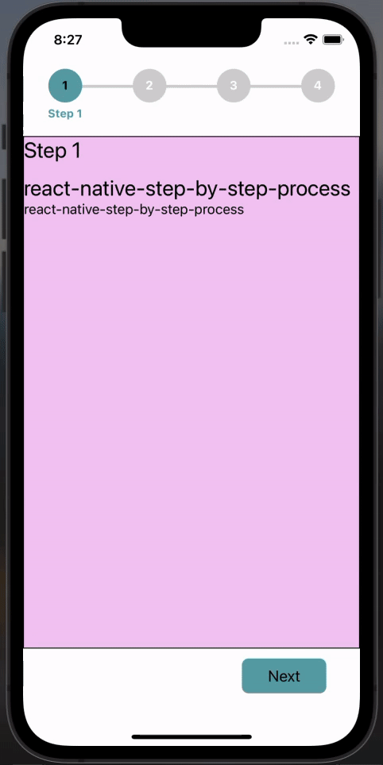

# react-native-step-by-step-process

A simple and fully customizable & fully adaptive UI with `Android`, `iOS`, `iPad` React Native component that implements a process steps UI.

- Unlimitaed Stpes Support.
- Each steps content is displayed inside of a Stps view with lable.
- Fully customizable buttons are displayed at the bottom of the component to navigate between steps.
- Provided `useProcess` Hook will help to get & set current step indexs & more.
- Constantly bug fixing and improvement supported & will support continuously.

|         iOS         | Android |
| :-----------------: | :-----: |
|  |    |

## Installation

If using yarn:

```
yarn add react-native-step-by-step-process
```

If using npm:

```
npm i react-native-step-by-step-process
```

## Usage

```
import {  ProcessContainer, createProcess, useProcess} from 'react-native-step-by-step-process';
```

First create Screen Component which will look like below and wrrap that with `ProcessContainer` and pass initial Number Of Steps to `initialNumberOfSteps`.

```
import React from 'react';
import {ProcessContainer} from 'react-native-step-by-step-process';

import ProcessStepsCompoents from '../components/ProcessStepsCompoents';

const ProcessStepsScreen = () => {
  return (
    <ProcessContainer initialNumberOfSteps={5}>
      <ProcessStepsCompoents />
    </ProcessContainer>
  );
};

export default ProcessStepsScreen;
```

Simply create process using `createProcess` method which will return `Process` Object and using that `Process` Object, place a `<Process.Step />` tag for each desired step within the `<Process.ProcessFlow />` wrapper.

```
import React from "react";
import { Text, View } from "react-native";
import {createProcess, useProcess} from 'react-native-step-by-step-process';

const Process = createProcess();

const ProcessStepsCompoents = () => {
  const {currentStep, activeStep} = useProcess();

  return (
    <View>
      <Process.ProcessFlow>
        <Process.Step>
            <View style={{ alignItems: 'center' }}>
                <Text>Step 1!</Text>
            </View>
        </Process.Step>
        <Process.Step>
            <View style={{ alignItems: 'center' }}>
                <Text>Step 2!</Text>
            </View>
        </Process.Step>
        <Process.Step>
            <View style={{ alignItems: 'center' }}>
                <Text>Step 3!</Text>
            </View>
        </Process.Step>
        <Process.Step>
            <View style={{ alignItems: 'center' }}>
                <Text>Step 4!</Text>
            </View>
        </Process.Step>
        <Process.Step>
            <View style={{ alignItems: 'center' }}>
                <Text>Step 4!</Text>
            </View>
        </Process.Step>
      </Process.ProcessFlow>
    </View>
  );
};

export default ProcessStepsCompoents;
```

### Current Step Error and Validation Handling

The `errors` should be used if there's a need for validation and error handling when clicking the next button. If you would like to prevent the next step from being rendered, Just `return` `true` or `false` from `onNext` function and `onPrevious` function. See below example below :

Example usage of validation check:

```
import React from "react";
import { Text, View } from "react-native";
import {createProcess, useProcess} from 'react-native-step-by-step-process';

const Process = createProcess();

const ProcessStepsScreen = () => {
  const {currentStep, activeStep} = useProcess();

  const onPressNextInStep = (nextStepIndex) => {
    if(nextStepIndex === 2){
        return true; // This will prevent the next step from being rendered
    }
  }

  return (
      <Process.ProcessFlow
        activeStepIconColor={'#60a4ac'}
        labelStyle={{color: '#60a4ac'}}
        nextButtonStyle={{backgroundColor: '#60a4ac'}}
        nextButtonTextStyle={{color: 'black'}}
        previousButtonStyle={{backgroundColor: '#60a4ac'}}
        previousButtonTextStyle={{color: 'black'}}
        nextButtonText={t('txtProceed')}
        previousButtonText={t('back')}
        onNext={onPressNextInStep}>
        <Process.Step
            label={t('txtFillStepDate')}
            showFirstStepPreviousButton={true}>
            <View style={{ alignItems: 'center' }}>
                <Text>Step 1!</Text>
            </View>
        </Process.Step>
            <View style={{ alignItems: 'center' }}>
                <Text>Step 2!</Text>
            </View>
        </Process.Step>
            <View style={{ alignItems: 'center' }}>
                <Text>Step 3!</Text>
            </View>
        </Process.Step>
            <View style={{ alignItems: 'center' }}>
                <Text>Step 4!</Text>
            </View>
        </Process.Step>
      </Process.ProcessFlow>
  );
};

export default ProcessStepsScreen;
```

## Documentation

### process Steps Component

| Name                   | Description                           | Default     | Type    |
| ---------------------- | ------------------------------------- | ----------- | ------- |
| activeStepIconColor    | Color of the active step icon         | transparent | String  |
| completedStepIconColor | Color of the completed step icon      | #4bb543     | String  |
| activeStepNumColor     | Color of the active step number       | black       | String  |
| disabledStepNumColor   | Color of the disabled step number     | white       | String  |
| completedCheckColor    | Color of the completed step checkmark | white       | String  |
| isComplete             | Set all Steps to active state         | false       | Boolean |

### process Step Component

| Name                        | Description                                              | Default                             | Type    |
| --------------------------- | -------------------------------------------------------- | ----------------------------------- | ------- |
| label                       | Title of the current step to be displayed                | null                                | String  |
| onNext                      | Function called when the next step button is pressed     | null                                | Func    |
| onPrevious                  | Function called when the previous step button is pressed | null                                | Func    |
| onSubmit                    | Function called when the submit step button is pressed   | null                                | Func    |
| nextButtonText              | Text to display inside the next button                   | Next                                | String  |
| previousButtonText          | Text to display inside the previous button               | Previous                            | String  |
| finishButtonText            | Text to display inside the button on the last step       | Submit                              | String  |
| nextButtonStyle             | Style object to provide to the next/finish buttons       | { textAlign: 'center', padding: 8 } | Object  |
| nextButtonTextStyle         | Style object to provide to the next/finish button text   | { color: '#007aff', fontSize: 18 }  | Object  |
| nextButtonDisabled          | Value to disable/enable next button                      | false                               | Boolean |
| previousButtonStyle         | Style object to provide to the previous button           | { textAlign: 'center', padding: 8 } | Object  |
| previousButtonTextStyle     | Style object to provide to the previous button text      | { color: '#007aff', fontSize: 18 }  | Object  |
| previousButtonDisabled      | Value to disable/enable previous button                  | false                               | Boolean |
| removeButtonRow             | Used to render the process step without the button row   | false                               | Boolean |
| showFirstStepPreviousButton | Used to render the previous button in first step         | false                               | Boolean |

## Contributing

Pull requests are always welcome! Feel free to open a new GitHub issue for any changes that can be made.

## Author

[Harshil Miyani](https://github.com/harshilmiyani)

## License

MIT
